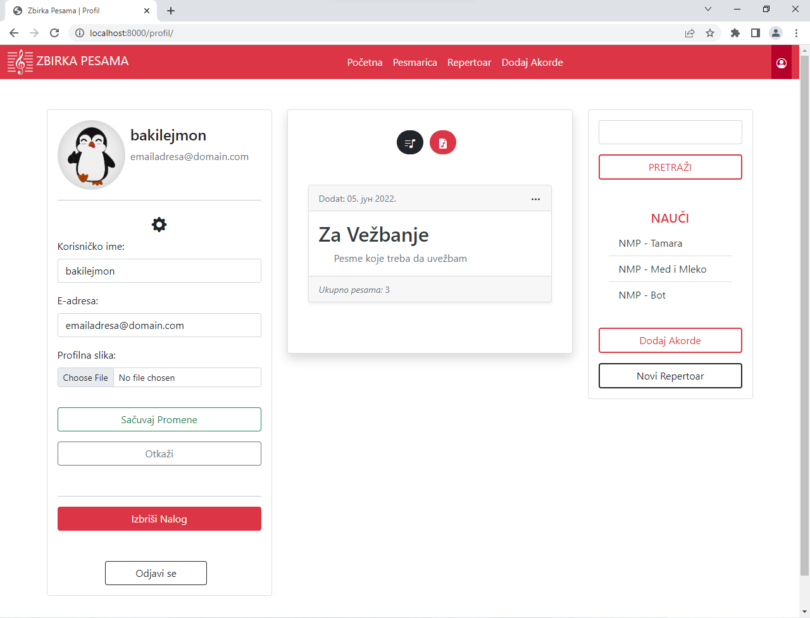
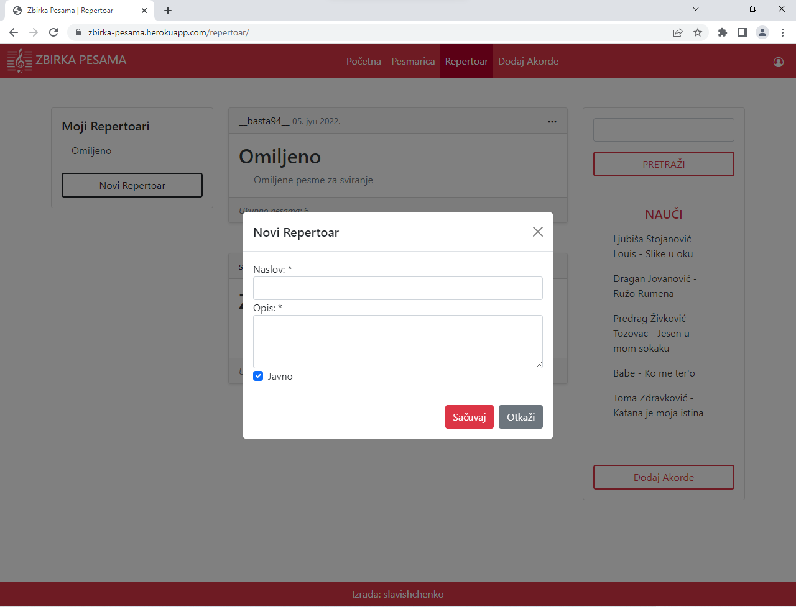
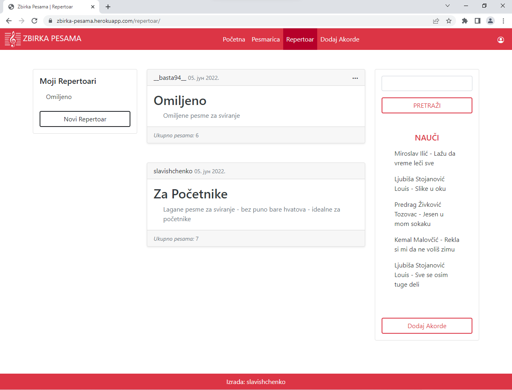
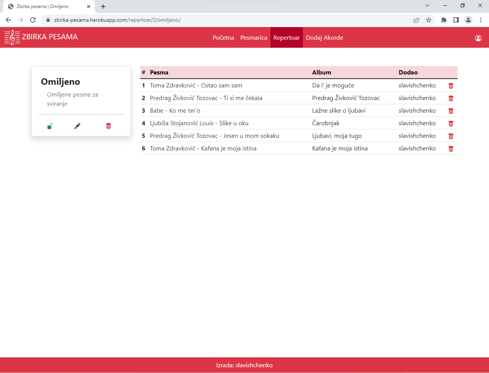
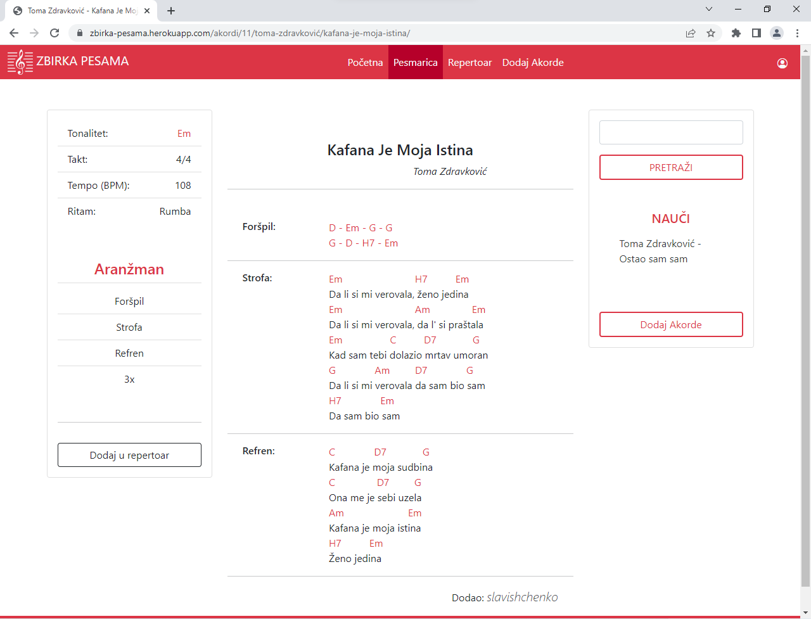

*__Zbirka Pesama__* is a digital songbook built with Django. 

On _Zbirka pesama_ you can: 
- Search for songs 
- Browse artists by genre
- Add chord sheets*
- Create your own, personal songbooks - let's call them - *setlists**
- Browse public setlists submitted by other users*

*_To submit chord sheets, and create and view setlists, you will have to create an account_

***

***

## User Profile
* You can create an account in a blink of an eye by providing a username, email, and password
* You can upload a profile picture and update account information on the profile page
* You can __easily__ delete your account; Just click the button, confirm and that's it. No need to tell us why. Oh, and, by the way, we'll permanently delete your account, so if you, later on, regret that decision, you'll have to create a new one
* In case you forgot your password, don't panic, just request a password reset link and we'll send it to your email. Convenient, right?
* You can view songs you submit and setlists you create on your profile page

***

## Chord sheets & Setlists
*_Only registered users can submit chord sheets and create setlists_

If you want to keep track of the songs you've learned or if you want to create a __To Learn__ list or, maybe, you just want to help out beginners by creating a list of beginner-friendly songs - doesn't matter - _setlists_ are there for you!

Fill out the form and - __boom!__ - you're ready to go!

_____

#### Setlist Features:

* Setlists can be private or public
* Public setlists are available on the _setlist_ page for everyone to view and enjoy
* You can change setlist visibility along with the name and the description by clicking the pen icon
* Lock icon will indicate whether the setlist is public or private
* You can delete the setlist by clicking the red trash can icon
* You can add songs to the setlist by clicking ⋮ on a song, and then selecting _Add to_
* To remove a song from a setlist, just click the trash can icon next to the song

***

## Chord Sheets

- Chords are accurate and in the original key
- Chords for intros, solos, improvs, etc. are included as well
- Chords sheets are accompanied with nice-to-know things about the song, such as tempo, strumming pattern, key, song structure, etc.
- In the sidebar, you can see recommended songs to learn next
- You can add a song to your setlist by clicking the "_Add to setlist_" button

