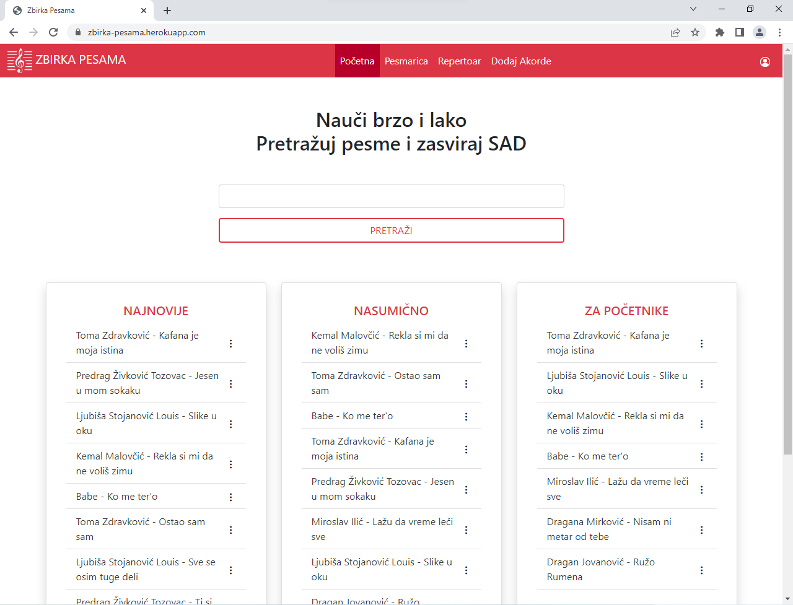

*__Zbirka Pesama__* is a digital songbook built with Django. 

On _Zbirka pesama_ you can: 
- Search for songs 
- Browse artists by genre
- Add chord sheets*
- Create your own, personal songbooks - let's call them - *setlists**
- Browse public setlists submitted by other users*

*_To submit chord sheets, and create and view setlists, you will have to create an account_

***

***

## User Profile
* To create an account, you'll need an email address, a unique username, and a strong password
* Once you're registered, you can upload a profile picture 
* You can __easily__ delete your account; Just click the button, confirm and that's it. No need to tell us why. Accounts are permanently deleted, so if you, later on, regret that decision, you'll have to create a new one
* In case you forgot your password, don't panic, just request a password reset link and we'll send it to your email. Convenient, right?

***

## Chord sheets & Setlists
*_Only registered users can submit chord sheets and create setlists_

If you want to keep track of the songs you've learned or if you want to create a __To Learn__ list or, maybe, you just want to help out beginners by creating a list of beginner-friendly songs - doesn't matter - _setlists_ are there for you!

Fill out the form and - __boom!__ - you're ready to go!

_____

#### Setlist Features:

* Setlists can be private or public
* Public setlists are available on the _setlist_ page for everyone to view and enjoy
* You can change setlist visibility along with the name and the description by clicking the pencil icon
* Lock icon will indicate whether the setlist is public or private
* You can delete the setlist by clicking the red trash can icon
* You can add songs to the setlist by clicking "⋮" on a song, and then selecting _Add to..._
* To remove a song from a setlist, just click the trash can icon next to the song

***

#### Chord Sheets

##### Submitting chord sheets

- To submit a chord sheet, click _Add chords_, fill out the form, and, after the admin has reviewed and approved your submission, chords will be made public
- **Chords have to be accurate and in the original key**
- **You have to include chords for intros, solos, improvs, etc**

##### Chord sheet page

- Chords sheets are accompanied with useful information about the song, such as tempo, strumming pattern, key, song structure, etc.
- In the sidebar, you can see recommended songs to learn next
- You can add a song to your setlist by clicking the "_Add to setlist_" button

## Technologies used

- Python/Django
- HTML5
- Bootstrap5
- CSS3

